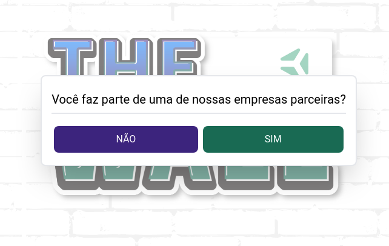

# Boas vindas ao The Wall

## Um projeto feito de pessoas da Turma 11 para a Turma 11 💚
  

## Sumário
  - ### [Primeira vez no site](#como-utilizar)
  - ### [Você é uma empresa parceira?](#sobre-empresas-parceiras)
  - ### [Exibição de pessoas estudantes](#sobre-as-pessoas-estudantes)
  - ### [O que é um dossiê?](#sobre-o-dossie)

## Como utilizar
 - ### Ao entrar a primeira vez no [The Wall](http://www.google.com.br/), você verá o seguinte pop-up abaixo:
    

 - ### Caso a resposta nesse pop-up seja positiva (SIM), você poderá ver o nome da empresa parceira no qual você representa.
    

 - ### Caso a resposta seja negativa, você terá acesso a um link que redirecionará para uma página de cadastro, que permite que a empresa no qual você está representando seja uma empresa parceira da Trybe.
    

## Sobre empresas parceiras
  - ### Independente se você é uma empresa parceira ou não, você ainda terá acesso completo ao The Wall, isso inclui:
    - ### Filtro por stack
    - ### Vídeo de pitch
    - ### Favoritar pessoas estudantes

  - ### Quando você é uma empresa parceira, além de você ter acesso ao The Wal, também terá acesso às informações extras sobre as pessoas estudantes que estão disponíveis apenas no dossiê da Trybe
    - ### O link do dossiê pode ser acessível após clicar em qualquer um dos cards das pessoas estudantes    

## Sobre as pessoas estudantes
  - ### Você verá uma lista de pessoas estudantes que possuem diversas habilidades técnicas que podem ser filtradas utilizando o filtro do topo da página.
    

  - ### Você pode assistir ao vídeo de apresentação quando clicar no card

  - ### Pode favoritar clicando no coração

  - ### Você pode clicar no botão "Ver dossiê" para visualizar o dossiê de uma pessoa específica
    

## Sobre o dossiê
  - ### O dossiê é uma forma de reunirmos ensumos acerca das pessoas estudantes, como por exemplo projetos de orgulho, LinkedIn e etc. Devido à Lei Geral de Proteção de Dados, não podemos disponibilizar estes dados abertamente, esperamos que você entenda. Por isso importante que você seja, primordialmente, uma empresa parceira para ter acesso a estes dados.
